<div align="center">


<br/>

[](https://linkedin.com/in/aftabkh4n)
[](https://dev.to/aftabkh4n)
[](https://www.nuget.org/profiles/aftabkh4n)

</div>

---

I build systems from the API down to the infrastructure. Kubernetes, Terraform, event driven pipelines, MCP servers, and CI/CD tooling that does something useful rather than something impressive.

Most of what I build ends up here as open source. Currently focused on MCP servers for AI assisted platform engineering, self healing Kubernetes automation, and event driven architecture with Kafka and Azure Service Bus.

---

<div align="center">

### ▸ BlazorMemory

**Give your .NET app a memory.**

[](https://www.nuget.org/packages/BlazorMemory)
[](https://www.nuget.org/packages/BlazorMemory)
[](https://github.com/aftabkh4n/BlazorMemory)

</div>

Most LLM apps forget everything the moment the session ends. BlazorMemory sits underneath your Blazor or ASP.NET Core app, pulls durable facts out of conversations, embeds them, and hands the relevant ones back the next time they matter. Ten months of work, shipped as a suite of NuGet packages.

```bash
dotnet add package BlazorMemory
```



<details>
<summary><b>Other published packages</b></summary>

<br/>

```mermaid
%%{init: {'theme':'base','themeVariables':{'primaryColor':'#0d1117','primaryTextColor':'#c9d1d9','primaryBorderColor':'#30363d','lineColor':'#3498db','secondaryColor':'#161b22','tertiaryColor':'#161b22','fontFamily':'JetBrains Mono, monospace'}}}%%
flowchart LR
    C["conversation"] --> X["fact extraction<br/>LLM"]
    X --> E["embeddings"]
    E --> V[("vector store")]
    V --> R["semantic recall"]
    R --> A["your app,<br/>with context"]
    A -.next session.-> C

    style C fill:#0d1117,stroke:#30363d
    style X fill:#132030,stroke:#8e44ad,stroke-width:2px
    style V fill:#132030,stroke:#2ecc71,stroke-width:2px
    style A fill:#132030,stroke:#3498db,stroke-width:2px
```

| Package | Downloads |
| --- | --- |
| `IdpPlatform.GitHub` |  |
| `TravelAI.Core` |  |

<!-- NUGET-STATS:START -->
`total packages: —` · `total downloads: —`
<!-- NUGET-STATS:END -->

Full list: [nuget.org/profiles/aftabkh4n](https://www.nuget.org/profiles/aftabkh4n)

</details>

---

## One API call, a whole service

This is what my [IDP Platform](https://github.com/aftabkh4n/idp-platform) does when a developer asks for a new service. Everything after the request happens without anyone touching a console.

```mermaid
%%{init: {'theme':'base','themeVariables':{'primaryColor':'#0d1117','primaryTextColor':'#c9d1d9','primaryBorderColor':'#30363d','lineColor':'#3498db','secondaryColor':'#161b22','tertiaryColor':'#161b22','fontFamily':'JetBrains Mono, monospace'}}}%%
flowchart LR
    DEV["developer<br/>POST /services"] --> API["IDP API<br/>.NET 9"]

    API --> GH["GitHub<br/>repo + branch rules"]
    API --> DOCK["Dockerfile<br/>per stack"]
    API --> K8S["Kubernetes<br/>ns + deploy + svc"]
    API --> CI["CI pipeline<br/>GitHub Actions"]

    CI --> AI["AI review<br/>GPT-4o-mini, every PR"]
    K8S --> OBS["Prometheus<br/>+ Grafana"]

    API -.live status.-> DEV

    style DEV fill:#0d1117,stroke:#3498db,stroke-width:2px
    style API fill:#132030,stroke:#3498db,stroke-width:2px
    style AI fill:#132030,stroke:#8e44ad,stroke-width:2px
    style OBS fill:#132030,stroke:#e67e22,stroke-width:2px
```



Provisioning that used to take most of a day now takes one request and a few minutes.

---

## What I've built

**Platform and infrastructure**

| | | |
| --- | --- | --- |
| [**GenAI DevOps Platform**](https://github.com/aftabkh4n/genai-devops-platform) | Detects pod failures, reads the logs with an LLM, opens a PR with the fix | `.NET 10` `Kubernetes` `Claude` |
| [**IDP Platform**](https://github.com/aftabkh4n/idp-platform) | One API call provisions a repo, Dockerfile, K8s deployment, and CI pipeline | `.NET 9` `K8s` `SignalR` `Postgres` |
| [**Terraform IDP**](https://github.com/aftabkh4n/terraform-idp) | Postgres, Kubernetes, Prometheus, Grafana, and AWS EKS from one `terraform apply` | `Terraform` `EKS` `Helm` |
| [**Travel Booking Platform**](https://github.com/aftabkh4n/travel-booking-platform) | Every request goes through a YARP gateway for auth and rate limiting, with an Angular dashboard on top | `.NET 10` `YARP` `Angular` `Mongo` |
| [**RebelDesk**](https://github.com/aftabkh4n/RebelDesk) | Self-hosted remote desktop over WebRTC. Windows agent, browser viewer, attended sessions with explicit host approval. Pre-alpha | `.NET 10` `SIPSorcery` `React` `coturn` |

**Distributed systems**

| | | |
| --- | --- | --- |
| [**Order Pipeline**](https://github.com/aftabkh4n/order-pipeline) | Outbox pattern, `FOR UPDATE SKIP LOCKED`, backoff, dead letter path. Runs locally | `.NET 10` `Kafka` `Service Bus` |
| [**TravelAI.Core**](https://github.com/aftabkh4n/TravelAI.Core) | API answers in under 100ms, workers do the slow AI calls out of band | `.NET 10` `RabbitMQ` `OTel` |
| [**Data Platform API**](https://github.com/aftabkh4n/data-platform) | Search and analytics API. Redis took repeat queries from 500ms to under 100ms | `.NET 9` `Postgres` `Redis` |

**AI tooling**

| | | |
| --- | --- | --- |
| [**ContextOS**](https://github.com/aftabkh4n/contextos) | Persistent memory for AI coding agents. Hybrid BM25 and vector search, git aware | `.NET 10` `SQLite` `ONNX` |
| [**MCP Kubernetes Manager**](https://github.com/aftabkh4n/mcp-kubernetes-manager) | Eight tools that let an AI assistant drive a real cluster in plain language | `.NET 9` `MCP` `K8sClient` |
| [**BlazorMemory**](https://github.com/aftabkh4n/BlazorMemory) | Fact extraction, vector search, and persistent memory for Blazor and ASP.NET Core | `.NET 9` `Blazor` `OpenAI` |

---

## Stack

```
lang        C#  ·  .NET 8/9/10  ·  TypeScript  ·  SQL
web         ASP.NET Core  ·  Blazor  ·  Razor Pages  ·  Angular  ·  YARP
cloud       AWS (EKS, IAM, VPC)  ·  Azure  ·  Kubernetes  ·  Docker
iac         Terraform  ·  Helm  ·  GitHub Actions
events      Kafka  ·  RabbitMQ  ·  Azure Service Bus  ·  MassTransit
data        PostgreSQL  ·  SQL Server  ·  MongoDB  ·  Redis
o11y        OpenTelemetry  ·  Serilog  ·  Prometheus  ·  Grafana
```

---

## Writing

<!-- BLOG-POST-LIST:START -->
- [How I Built 50 Developer Tools That Run Entirely in the Browser](https://dev.to/aftabkh4n/how-i-built-50-developer-tools-that-run-entirely-in-the-browser-3a6a)
- [My tests were describing the code, not checking it](https://dev.to/aftabkh4n/my-tests-were-describing-the-code-not-checking-it-3m2p)
- [BlazorMemory 1.0 is out. Ten months, 14 packages, and what I got wrong along the way.](https://dev.to/aftabkh4n/blazormemory-10-is-out-ten-months-14-packages-and-what-i-got-wrong-along-the-way-1548)
- [BlazorMemory v0.8.0: Semantic Kernel adapter, Ollama embeddings, and memory decay](https://dev.to/aftabkh4n/blazormemory-v080-semantic-kernel-adapter-ollama-embeddings-and-memory-decay-oom)
- [Turning TravelAI.Core Into a Real Production System](https://dev.to/aftabkh4n/turning-travelaicore-into-a-real-production-system-3npm)
<!-- BLOG-POST-LIST:END -->

---

---

<div align="center">

<sub>Based in Doha · building in public · <a href="https://github.com/aftabkh4n?tab=repositories">all repositories →</a></sub>

</div>
