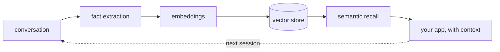
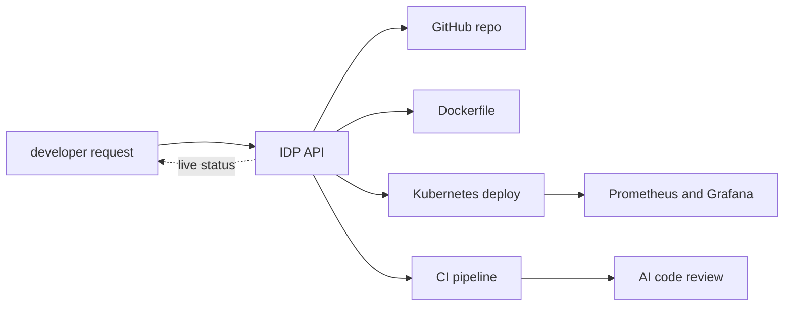

<!-- ============================================================ -->
<!--                            HEADER                            -->
<!-- ============================================================ -->
<div align="center">

# Aftab Bashir

#### Senior .NET Engineer · Platform & Backend · Open Source Builder


</div>

<!-- ============================================================ -->
<!--                       SOCIAL + METRICS                       -->
<!-- ============================================================ -->
<div align="center">

[](https://linkedin.com/in/aftabkh4n)
[](https://dev.to/aftabkh4n)
[](https://www.nuget.org/profiles/aftabkh4n)
[](mailto:aftab966@gmail.com)

[](https://github.com/aftabkh4n?tab=followers)
[](https://github.com/aftabkh4n)

</div>

---

<table>
<tr>
<td width="60%" valign="top">

## 👋 Who I Am

I'm Aftab Bashir, a senior .NET engineer with nine years building production systems that other people depend on, across government, enterprise and commercial environments.

My day job is secure enterprise applications in a regulated environment. Everything else I build ends up here as open source: MCP servers for AI assisted platform engineering, internal developer platforms, event driven pipelines on Kafka and RabbitMQ, and infrastructure as code with Terraform.

I write about what I build on Dev.to, including the parts I got wrong, and publish the reusable pieces to NuGet.

</td>
<td width="40%" valign="top">

## ⚡ At a Glance

```yaml
name:        Aftab Bashir
role:        Senior .NET Engineer
focus:       Backend · Platform · K8s
experience:  9 yrs in production
based:       Doha, Qatar
stack:       C# · .NET 10 · Kubernetes
clouds:      AWS · Azure · GCP
packages:    published on NuGet
writing:     dev.to/aftabkh4n
learning:    AWS CDK · CodeBuild
```

</td>
</tr>
</table>

---

<!-- ============================================================ -->
<!--                  CURRENTLY BUILDING / LEARNING               -->
<!-- ============================================================ -->
## 🔭 Currently Building & Learning

<table>
<tr>
<td width="50%" valign="top">

### 🛠️ Building
- 🧠 ContextOS, persistent memory for AI coding agents
- 🤖 MCP servers for Kubernetes and platform tooling
- 🔁 Event driven pipelines with Kafka and Service Bus
- 📦 BlazorMemory, an AI memory layer for .NET

</td>
<td width="50%" valign="top">

### 🌱 Learning & Exploring
- ☁️ AWS CDK and CodeBuild, infrastructure as code beyond Terraform
- 🧩 MCP protocol internals and agent tooling
- 📊 OpenTelemetry tracing across distributed services
- 🔐 Azure DevOps practices (AZ-400)

</td>
</tr>
</table>

---

<!-- ============================================================ -->
<!--                     FEATURED PACKAGE                         -->
<!-- ============================================================ -->
<div align="center">

### ▸ BlazorMemory

**Give your .NET app a memory.**

[](https://www.nuget.org/packages/BlazorMemory)
[](https://www.nuget.org/packages/BlazorMemory)
[](https://github.com/aftabkh4n/BlazorMemory)

</div>

Most LLM apps forget everything the moment the session ends. BlazorMemory sits underneath your Blazor or ASP.NET Core app, pulls durable facts out of conversations, embeds them, and hands the relevant ones back the next time they matter. Ten months of work, shipped as a suite of NuGet packages.

```bash
dotnet add package BlazorMemory
```


```mermaid
flowchart LR
    C["conversation"] --> X["fact extraction"]
    X --> E["embeddings"]
    E --> V[("vector store")]
    V --> R["semantic recall"]
    R --> A["your app, with context"]
    A -.->|next session| C
```

<details>
<summary><b>Other published packages</b></summary>

<br/>

| Package | Downloads |
| --- | --- |
| `IdpPlatform.GitHub` |  |
| `TravelAI.Core` |  |

<!-- NUGET-STATS:START -->
`total packages: —` · `total downloads: —`
<!-- NUGET-STATS:END -->

Full list: [nuget.org/profiles/aftabkh4n](https://www.nuget.org/profiles/aftabkh4n)

</details>

---

<!-- ============================================================ -->
<!--                     ARCHITECTURE SHOWCASE                    -->
<!-- ============================================================ -->
## 🏗️ One API Call, a Whole Service

This is what my [IDP Platform](https://github.com/aftabkh4n/idp-platform) does when a developer asks for a new service. Everything after the request happens without anyone touching a console.


```mermaid
flowchart LR
    DEV["developer request"] --> API["IDP API"]
    API --> GH["GitHub repo"]
    API --> DOCK["Dockerfile"]
    API --> K8S["Kubernetes deploy"]
    API --> CI["CI pipeline"]
    CI --> AI["AI code review"]
    K8S --> OBS["Prometheus and Grafana"]
    API -.->|live status| DEV
```

Provisioning that used to take most of a day now takes one request and a few minutes.

---

<!-- ============================================================ -->
<!--                       FEATURED PROJECTS                      -->
<!-- ============================================================ -->
## 📌 Featured Projects

<div align="center">

[](https://github.com/aftabkh4n/contextos)
[](https://github.com/aftabkh4n/BlazorMemory)
[](https://github.com/aftabkh4n/idp-platform)
[](https://github.com/aftabkh4n/mcp-kubernetes-manager)
[](https://github.com/aftabkh4n/order-pipeline)
[](https://github.com/aftabkh4n/terraform-idp)

</div>

<details>
<summary><b>Everything else I've built</b></summary>

<br/>

**Platform and infrastructure**

| | | |
| --- | --- | --- |
| [**GenAI DevOps Platform**](https://github.com/aftabkh4n/genai-devops-platform) | Detects pod failures, reads the logs with an LLM, opens a PR with the fix | `.NET 10` `Kubernetes` `Claude` |
| [**Travel Booking Platform**](https://github.com/aftabkh4n/travel-booking-platform) | Every request goes through a YARP gateway for auth and rate limiting, with an Angular dashboard on top | `.NET 10` `YARP` `Angular` `Mongo` |

**Distributed systems**

| | | |
| --- | --- | --- |
| [**TravelAI.Core**](https://github.com/aftabkh4n/TravelAI.Core) | API answers in under 100ms, workers do the slow AI calls out of band | `.NET 10` `RabbitMQ` `OTel` |
| [**Data Platform API**](https://github.com/aftabkh4n/data-platform) | Search and analytics API. Redis took repeat queries from 500ms to under 100ms | `.NET 9` `Postgres` `Redis` |

</details>

---

<!-- ============================================================ -->
<!--                          TECH STACK                          -->
<!-- ============================================================ -->
## 🧰 Tech Stack

<div align="center">
  
  &nbsp;&nbsp;
  
  &nbsp;&nbsp;
  
  &nbsp;&nbsp;
  
</div>

<br/>

<table align="center">
<tr>
<td align="right" width="190"><b>💻 Languages & Core</b></td>
<td>
  
  
  
  
  
  
</td>
</tr>
<tr>
<td align="right"><b>🌐 Web & Frameworks</b></td>
<td>
  
  
  
  
</td>
</tr>
<tr>
<td align="right"><b>☁️ Cloud · DevOps</b></td>
<td>
  
  
  
  
  
  
  
</td>
</tr>
<tr>
<td align="right"><b>🗄️ Data · Messaging</b></td>
<td>
  
  
  
  
  
  
</td>
</tr>
</table>

<div align="center">

**🔭 Observability · AI Tooling**


</div>

---

<!-- ============================================================ -->
<!--                           WRITING                            -->
<!-- ============================================================ -->
## ✍️ Writing

<!-- BLOG-POST-LIST:START -->
- [What spanner for an M12 bolt? An agent that knows DIN and ISO disagree](https://dev.to/aftabkh4n/what-spanner-for-an-m12-bolt-an-agent-that-knows-din-and-iso-disagree-32km)
- [I got tired of re-explaining my codebase to Claude every morning, so I built this](https://dev.to/aftabkh4n/i-got-tired-of-re-explaining-my-codebase-to-claude-every-morning-so-i-built-this-5eo5)
- [How I Built 50 Developer Tools That Run Entirely in the Browser](https://dev.to/aftabkh4n/how-i-built-50-developer-tools-that-run-entirely-in-the-browser-3a6a)
- [My tests were describing the code, not checking it](https://dev.to/aftabkh4n/my-tests-were-describing-the-code-not-checking-it-3m2p)
- [BlazorMemory 1.0 is out. Ten months, 14 packages, and what I got wrong along the way.](https://dev.to/aftabkh4n/blazormemory-10-is-out-ten-months-14-packages-and-what-i-got-wrong-along-the-way-1548)
<!-- BLOG-POST-LIST:END -->

---

<!-- ============================================================ -->
<!--                     CONTRIBUTION SNAKE                       -->
<!-- ============================================================ -->
### 🐍 Watch My Contributions Get Eaten

<div align="center">

<picture>
  <source media="(prefers-color-scheme: dark)" srcset="https://raw.githubusercontent.com/aftabkh4n/aftabkh4n/output/snake-dark.svg" />
  <source media="(prefers-color-scheme: light)" srcset="https://raw.githubusercontent.com/aftabkh4n/aftabkh4n/output/snake.svg" />
  
</picture>

</div>

---

<!-- ============================================================ -->
<!--                           FOOTER                             -->
<!-- ============================================================ -->
<div align="center">

<sub>Based in Doha · building in public · <a href="https://github.com/aftabkh4n?tab=repositories">all repositories →</a></sub>

</div>
